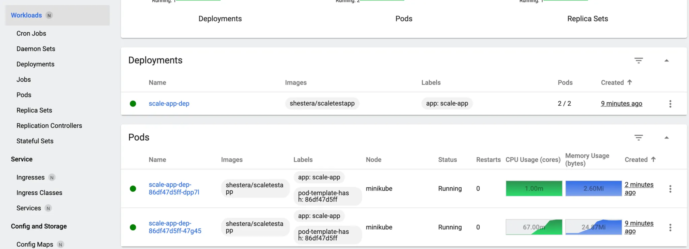

# Динамическое масштабирование контейнеров      

При временно возникающих пиковых нагрузках на приложение из-за нехватки ресурсов(cpu, memory) для пода применяется динамическое масштабирование.         
Динамическое масшабирование может быть горизонтальным(изменение количества подов, т.е. экземпляров приложеиня), верикальным(изменение ресурсов по cpu и memory), 
кластерным(изменение количества нод в кластере).        
Kubernetes производит динамическое масштабироване на основе метрик, полученных от встроенного metrics service или custom metrics.       

Локальный кластер развернут с использованием minikube.
```
brew install minikube
brew install kubectl
minikube start --addons=metrics-server
```
Настройки установки приложения указаны в deployment.yaml.      
Настройки доступа к приложению указаны в service.yaml.                  
Настройки горизонтального динамического масштабирования подов указаны hpa.yml.      
```
kubectl apply -f deployment.yaml
kubectl apply -f service.yaml
kubectl apply -f hpa.yaml
```

Dashboard Kubernetes  
```
minikube dashboard
```

Настройка внешнего доступа, создание туннеля
```
kubectl port-forward deployment/scale-app-dep 8080:8080
```
Приложение доступно на 8080 порту, метрики - по 8080/metrics.   

Для выполнения нагрузки на приложение используется locust с настройкой сценария поведения пользователя в locustfile.py     
```
locust
```

#### Дашборд kubernetes      
Без масштабирования     


С масштабированием      



