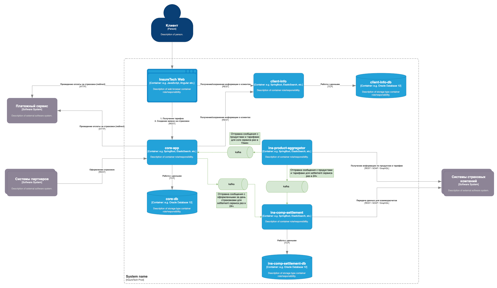

# Переход на Event-Driven архитектуру   

#### Текущая архитектура     

Список проблем и рисков, которые связаны с планируемым ростом нагрузки:     
- сильная связанность компонентов, деградация одного влияет на работу другого синхронного компонета;
- увеличивается время запроса при синхронном взаимодействии;  
- сложности с масштабированием синхронных компонентов;

Внедрение Event-Driven архитектуры позволит     
- сделать слабую связанность между компонентами, деградация одного компонента не повлияет на работу всей системы;      
- упростить горизонтальное масштабирование благодаря асинхронному взаимодействию между компонентами;       
- гибко внедрять новую функциональность асинхронных компонентов;   
- быстрее реагировать на события;     

#### Архитектура на основе асинхронных взаимодействий    
