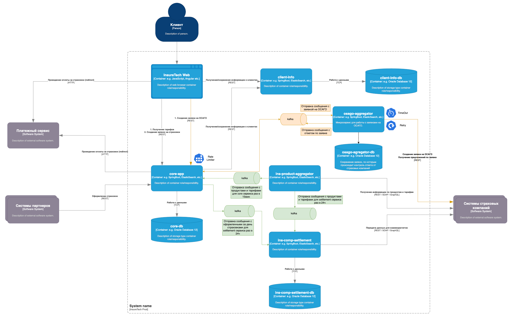

# Проектирование продажи ОСАГО

При созданнии новой заявки core-service отправляет событие в брокер и сохраняем в свою бд информацию по ней. Событие на создание 
заявки асинхронно обрабатывает osago-agregator, делает запросы в страховые компании и при получении ответов публикует событие, которое 
обрабатывает core-service и отображает пользователю. 
На запросы от пользователей по проверке созданной заявки предлагается сделать ограничение по паттерну Rate Limiting.

#### Целевая архитектура нового сервиса с асинхронным взаимодействием        
